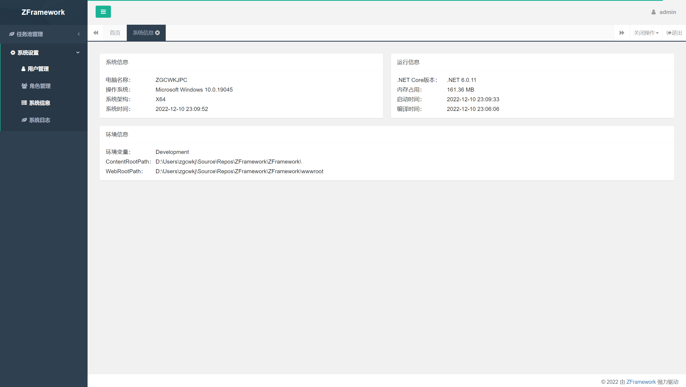

# ZFramework

## 框架前身

[ZFramework_CSharpMVC](https://github.com/zgcwkj/ZFramework_CSharpMVC)

## 框架说明

暂无

## 框架图片

## 致敬

1. [zgcwkj.DotnetCore](https://github.com/zgcwkj/zgcwkj.DotnetCore)
2. [YiShaAdmin](https://github.com/liukuo362573/YiShaAdmin)
2. [H +](https://gitee.com/hplus_admin/hplus)
2. [Layui](https://github.com/layui/layui)
